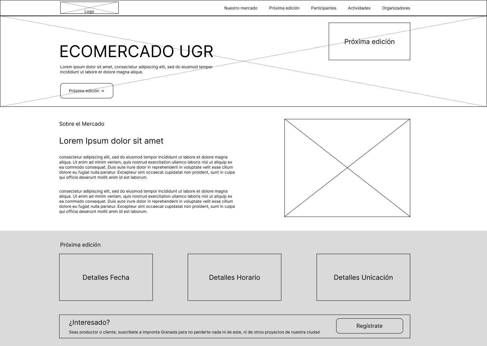
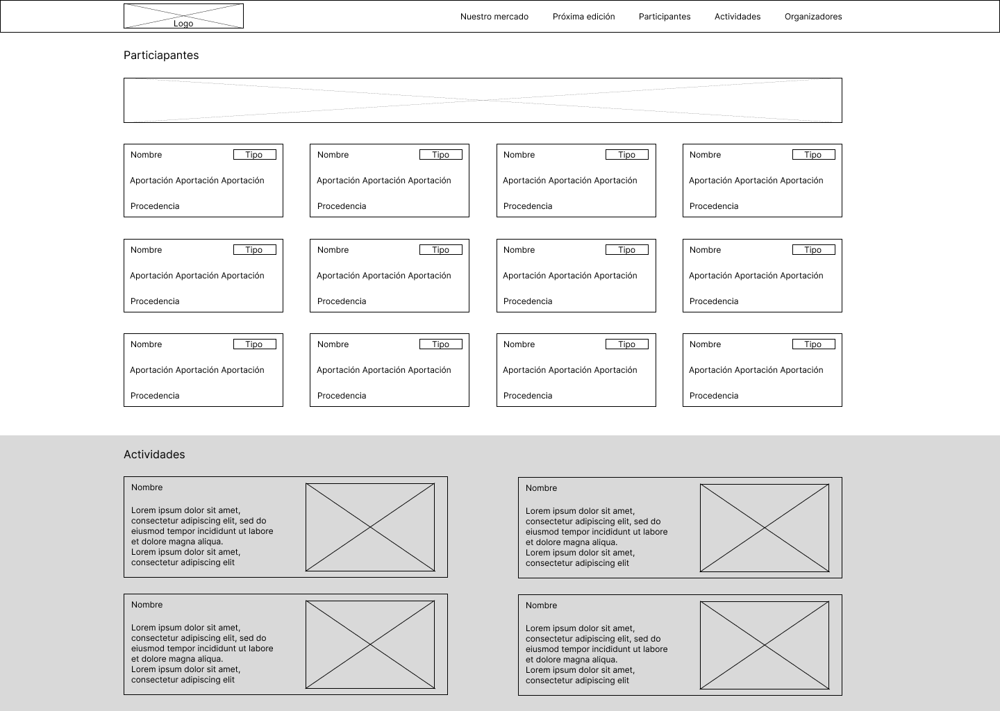

# DIU-Final
Trabajo Final DIU, curso académico 25/26

## PARTE I: Mi Experiencia UX
---
### 1.1. Introducción y Filosofía UX
Mi perspectiva y evolución como diseñador de interfaces de usuario (UI) y analista de experiencia de usuario (UX) se fundamenta estrictamente en el marco metodológico del **Diseño Centrado en el Usuario (DCU)**. A lo largo del periodo académico, he interiorizado que la disciplina de UX/UI trasciende la mera ejecución estética u ornamental de los componentes gráficos de un sistema web o móvil. Por el contrario, radica en el modelado, análisis y alineación de los **modelos mentales** del usuario con el modelo del sistema, persiguiendo la optimización empírica de tres pilares fundamentales: la usabilidad, la accesibilidad universal y la eficiencia en los flujos interactivos. 

El diseño de interfaces interactivo no debe ser un proceso estocástico ni basado en la intuición personal. Como futuro ingeniero, considero que el software debe adaptarse simbióticamente a las capacidades cognitivas, limitaciones físicas y contextos de uso de los seres humanos. A través de este porfolio, articulo y justifico de forma objetiva las competencias críticas y técnicas adquiridas, detallando mi proceso de maduración técnica y metodológica en la toma de decisiones de diseño.

### 1.2. Aportaciones y Contribuciones en Actividades de Clase
Durante el desarrollo práctico y los seminarios de la asignatura, asumí un rol proactivo en las dinámicas de codiseño, evaluación experta y análisis crítico. A continuación, desgloso el impacto cualitativo de las principales actividades realizadas, vinculando las evidencias empíricas con los conceptos teóricos de la disciplina:

* **Ejercicio Etnográfico (User Research de Campo):** Esta dinámica supuso el primer contacto con la investigación cualitativa fuera del laboratorio. Nos enfocamos en la observación no intrusiva de elementos cotidianos cuyo funcionamiento se asume correcto por pura habituación, pero que en la práctica presentan fricciones severas. Comprendí de manera empírica conceptos como el *affordance* (percepción de las propiedades funcionales de un objeto) y las **brechas de ejecución y evaluación de Donald Norman**. La lección técnica subyacente fue clara: que una interfaz "parezca funcionar" o "permita completar la tarea a duras penas" no implica que sea usable. Este ejercicio afinó mi sensibilidad al detalle para identificar microfricciones antes de que se trasladen al código.
* **Moodboard y Sistemas de Estilo Cohesivos:** El desarrollo del *moodboard* sirvió como artefacto de transferencia conceptual para traducir abstracciones emocionales e identidades de marca en directrices visuales tangibles (paletas cromáticas, tipografías, iconografía y peso visual). Su aplicación posterior en un prototipado rápido evidenció la utilidad de unificar las pautas de estilo. En un entorno de desarrollo colaborativo y paralelo, la falta de una "fuente única de verdad" visual deriva inevitablemente en disonancias cognitivas para el usuario y código redundante. Esta actividad sembró las bases para comprender la necesidad de los sistemas de diseño (Design Systems).
* **Evaluación Biométrica mediante Eyetracking:** El uso de herramientas de seguimiento ocular (*eyetracking*) transformó la evaluación de interfaces de una actividad interpretativa a una ciencia basada en datos cuantificables. Analizando métricas como los mapas de calor (*heatmaps*), los mapas de opacidad y las rutas sacádicas (*scanpaths*), pudimos validar empíricamente la jerarquía visual de las pantallas. Aprendimos a contrastar la teoría del **patrón de lectura en F y Z** y a delimitar adecuadamente las Áreas de Interés (AOI) para asegurar que los elementos críticos de conversión (como los botones Call-to-Action) capturen de verdad la atención del usuario sin sobrecargar su memoria de trabajo.
* **Inspección de Usabilidad Avanzada con Heurio:** La evaluación heurística de portales web universitarios reales mediante la herramienta *Heurio* nos permitió adoptar la postura de un evaluador experto. Aplicando de forma rigurosa las **10 Heurísticas de Jakob Nielsen**, pudimos auditar flujos complejos y catalogar las vulnerabilidades del sistema según su índice de severidad (de 0 a 4). La conclusión más valiosa fue constatar cómo malas decisiones de microdiseño, aparentemente inofensivas (como la falta de un *breadcrumb* claro o mensajes de error crípticos que violan la heurística de "reconocimiento antes que recuerdo"), degradan por completo la experiencia de usuarios que se enfrentan a tareas específicas bajo estrés o presión de tiempo.
* **Auditoría de Accesibilidad Universal (WCAG 2.1):** Mediante el uso combinado de validadores automáticos y simuladores de contexto (*WAVE Web Accessibility Tool*, *Web Developer Extension* y *Web Disability Simulator*), analizamos el portal web de una administración pública local. Esta actividad supuso un choque de realidad técnica al evaluar la interfaz bajo escenarios de diversidad funcional (ceguera legal, daltonismo en sus variantes de deuteranopía/protanopía, temblores motores o limitaciones cognitivas). Aprendimos a auditar la conformidad con las pautas **WCAG 2.1 en su nivel AA**, evaluando ratios de contraste de color en texto e iconografía, la independencia del dispositivo (navegación estricta por teclado) y la semántica del árbol del DOM (etiquetado estructural y atributos `aria-label` para lectores de pantalla como NVDA o JAWS).
* **MicroInteracción y Diseño Generativo con FigmaMake:** La experimentación con *FigmaMake* nos aproximó al estado del arte en herramientas de IA aplicadas a la generación automatizada de componentes de interfaz. Esta práctica nos enseñó que la IA es un acelerador de la fase de convergencia en ideación, pero carece de la sensibilidad heurística humana. El verdadero valor de nuestro rol no radicó en generar las pantallas de forma masiva, sino en actuar como filtros críticos: saber qué patrones de interacción mantener, cómo corregir problemas de alineación espacial (mediante *Auto Layout*) y cómo guiar los prompts para que el resultado final respetara los principios de consistencia y flexibilidad del sistema.

### 1.3. Desglose de Prácticas y Calidad de los Entregables
El bloque práctico de laboratorio constituyó un proceso de diseño iterativo y validación constante. Pasamos de la abstracción del problema de negocio al despliegue de un prototipo interactivo de alta fidelidad, aplicando pautas científicas de usabilidad y diseño responsivo:

| Entregable / Fase                                                   | Metodología y Técnicas de Diseño Aplicadas                                                                                                                                                                                                                                                                                                                                                           | Impacto Cuantitativo y Cualitativo en el Proyecto                                                                                                                                                                                                                                                                                                        |
| :------------------------------------------------------------------ | :--------------------------------------------------------------------------------------------------------------------------------------------------------------------------------------------------------------------------------------------------------------------------------------------------------------------------------------------------------------------------------------------------- | :------------------------------------------------------------------------------------------------------------------------------------------------------------------------------------------------------------------------------------------------------------------------------------------------------------------------------------------------------- |
| **Fase 1: UX User & Desk Research & Análisis de Competencia**       | Planificación mediante un *User Research Plan* (URP). Realización de un análisis de competencia directa/indirecta (*Competitive Benchmarking*) y un examen de usabilidad profundo (*Usability Review*). Creación de arquetipos de usuarios (*User Personas*) y mapas de experiencia del usuario (*Journey Maps*).                                                                                    | Evitó la asimetría de información. Identificamos los antipatrones del sector y los cuellos de botella recurrentes de la competencia. El modelado de Personas ancló el diseño a necesidades conductuales reales, definiendo con precisión qué requerimientos eran críticos y cuáles secundarios.                                                          |
| **Fase 2: Arquitectura de la Información y UX Design**              | Traducimos los *insights* de la fase de empatía en especificaciones arquitectónicas. Diseñamos el mapa del sitio (*Sitemap*) estructurando la jerarquía taxonómica de la información y definimos el flujo de tareas (*Task Flows*). Culminamos con la técnica de prototipado de baja fidelidad realizando bocetos a mano (*Paper Prototyping*) y *Wireframes* estructurales.                         | Garantizó que la navegación fuera intuitiva, reduciendo la carga cognitiva y el número de clics para completar las acciones principales. El diseño en escala de grises forzó a que el equipo se concentrara de forma exclusiva en la disposición espacial de la información y la funcionalidad, aislando sesgos estéticos prematuros.                    |
| **Fase 3: UI Prototyping & UX-Case Study (Alta Fidelidad)**         | Creación de un sistema de diseño estructurado (*UI Kit / Guidelines*) que incluyó la definición atómica de componentes interactivos (estados de botones, formularios, alertas y tipografía dinámica). Implementación del *Mockup* interactivo de alta fidelidad utilizando Figma, integrando microinteracciones. Usamos *FigmaMake* como inspiración controlada para el diseño de la *Landing Page*. | Consolidó la identidad visual, la consistencia inter-pantalla y la predictibilidad del comportamiento del sistema. El prototipo de alta fidelidad pasó de ser un dibujo estático a un sistema interactivo realista con transiciones fluidas, reduciendo la distancia entre el concepto de diseño y la posterior fase de desarrollo de software.          |
| **Fase 4: Evaluación de Usabilidad, Pruebas Empíricas e Iteración** | Planificación y ejecución de pruebas con usuarios reales de forma remota y presencial. Implementación de metodologías de *A/B Testing*, administración del cuestionario estandarizado *System Usability Scale* (SUS) y análisis cualitativo mediante test de pensamiento en voz alta (*Think-Aloud Protocol*). Redacción de un *Accessibility Report* final.                                         | Proporcionó validación empírica indiscutible. La puntuación del SUS nos otorgó una métrica cuantitativa del grado de usabilidad percibida. Las pruebas destaparon problemas ocultos en los flujos de navegación secundarios, lo que nos permitió ejecutar una fase de iteración y rediseño de componentes para pulir el software antes de su despliegue. |

### 1.4. Conclusión del Grado de Experiencia Adquirido
La ejecución holística de este itinerario de diseño me ha permitido reconfigurar por completo mi esquema mental respecto al desarrollo de productos de software. Como desarrollador, es habitual cometer el error de incurrir en el sesgo de egocentrismo ("yo soy el usuario"), asumiendo que un sistema es intuitivo simplemente porque su creador entiende la lógica subyacente del código. La asignatura de Diseño de Interfaces de Usuario ha derribado este paradigma.

He interiorizado que el éxito, la tasa de retención y la eficiencia de un sistema interactivo están gobernados de forma estricta por variables humanas: la facilidad de aprendizaje (*learnability*), la tolerancia a errores del sistema, la claridad en el *feedback* visual y la mitigación del esfuerzo cognitivo del usuario. Considero que mi competencia técnica ha experimentado un salto cualitativo exponencial: hoy no solo soy capaz de maquetar código robusto, sino que poseo las herramientas metodológicas, heurísticas y analíticas para auditar, diseñar y validar sistemas digitales que priorizan a las personas, garantizando entornos inclusivos, usables y accesibles bajo cualquier circunstancia o contexto físico y tecnológico.

## PARTE II: Caso de Estudio - Propuesta de Diseño ECO MERCADO UGR
---
### 2.1. Análisis de Usabilidad de "Huerta Madrid" (nuestrashuertas.com)
Para cimentar una propuesta de valor sólida, se realiza una inspección heurística como experto del portal de referencia **Huerta Madrid** (enfocado en la venta de cestas agroecológicas de Bustarviejo).

#### A. Evaluación Heurística (Principios de Nielsen & Tognazzini)
1. **Visibilidad del Estado del Sistema (Heurística 1):** El portal web gestiona de manera adecuada la persistencia del carrito en su subdominio de tienda (`tienda.nuestrashuertas.com`). Sin embargo, el traspaso entre la web informativa principal y la plataforma e-commerce genera fricción en el modelo mental del usuario, al cambiar drásticamente la distribución del menú de navegación.
2. **Flexibilidad y Eficiencia de Uso (Heurística 7):** Presenta una buena estructuración de categorías en la sección "Despensa" (Cereales, Quesería, Verduras). No obstante, carece de un sistema de aceleradores o "compra recurrente en 1 clic" para las cestas familiares semanales, lo cual penaliza al usuario experto que realiza pedidos idénticos periódicamente.
3. **Consistencia y Estándares (Heurística 4):** Se respetan las convenciones web globales de comercio electrónico (icono de carrito arriba a la derecha, buscador central). 

#### B. Accesibilidad (Criterios WCAG)
* **Contraste de Color:** La paleta basada en tonos verdes y orgánicos cumple con las ratios de contraste mínimos (4.5:1) en los textos principales, pero algunos botones secundarios sobre fondos claros disminuyen la legibilidad para usuarios con deficiencias visuales.
* **Estructura del DOM:** Se observa falta de etiquetado semántico estricto (`aria-labels`) en los formularios de filtrado de productos, dificultando la navegación mediante lectores de pantalla.

#### C. Adaptación Multidispositivo (Responsive Layout)
El diseño se adapta mediante una rejilla fluida (Fluid Grid) a pantallas móviles. Sin embargo, en la vista móvil, las tablas de precios de los lotes y cestas pierden su orden lógico, forzando un scroll horizontal excesivo que entorpece la experiencia de compra en ruta.

#### D. Usability Review
Se ha realizado un usability review para exponer de forma sistematizada las deficiencias y fortalezas de la página, el cual ha terminado calificando la página con un 78, una puntuación decente, pero que expone que hay algunos matices cuya mejora debe ser prioritaria.

[Enlace al pdf](Resources/Usability-review.pdf)

### 2.2. Propuesta de Valor para ECOMERCADO UGR
El **Ecomercado UGR** es una iniciativa conjunta entre la *Universidad de Granada* y la *Red Agroecológica de Granada*, celebrada en los **Paseíllos Universitarios de Fuentenueva** y complementada con jornadas académicas en la **ETS de Ingeniería de Edificación (ETSIE)**.

#### A. Insights Extraídos de la Realidad del Ecomercado UGR
1. **Periodicidad vs Persistencia:** Al ser un evento mensual y no una tienda física permanente, el usuario no busca comprar diariamente, sino **planificar** su asistencia o reservar productos con antelación. De esta forma, se concluye que la fecha y lugar juegan un papel principal en el interés del usuario.
2. **Perfil del Usuario Mixto:** La audiencia está segregada de forma muy marcada en tres grupos: Estudiantes (bajo presupuesto, buscan snacks o fruta lista para consumir), PAS/PDI (mayor poder adquisitivo, buscan cestas completas, quesos y cosmética artesanal) y Ciudadanía vecina del campus.
3. **Identidad Heredada**: Las páginas que estamos tratando son publicaciones dentro de otra, [Impronta Granada](https://improntagranada.es), por lo que es indispensable mantener la estética original y buscar la cohesión visual con la página matriz para no causar una gran disrupción al usuario al entrar a las noticias y eventos del ecomercado.

#### B. Propuesta de Arquitectura
Se propone el diseño de una **Web propia**, enfocada en resumir de manera útil la información relevante al proyecto mientras mantiene cierta dependencia con **Impronta Granada**. A continuación se detalla el Boceto, el cual debe ser tomado como una única página, aunque su estructura permite la división de esta en diferentes páginas que mantengan su información relevante.

### 2.3. Autoevaluación y Reflexión Crítica 
Al contrastar las prácticas realizadas durante el curso con este análisis de un escenario real, se extraen las siguientes conclusiones técnicas: 
* **Fortalezas Aplicadas:** La utilización de metodologías ágiles de prototipado rápido en Figma nos ha capacitado para estructurar soluciones de interfaz en tiempo récord. El análisis heurístico exhaustivo ha evitado caer en subjetividades personales. 
* **Gaps o Aspectos a Mejorar (Lecciones Aprendidas):** En nuestras prácticas previas obviamos las limitaciones logísticas del mundo físico. Diseñar para el Ecomercado UGR requiere comprender factores exógenos al software (horarios estrictos del campus, logística de transporte de los agricultores de la provincia de Granada, etc.). En futuros proyectos, la fase de investigación etnográfica e indagación de contexto (Contextual Inquiry) deberá ser más profunda.